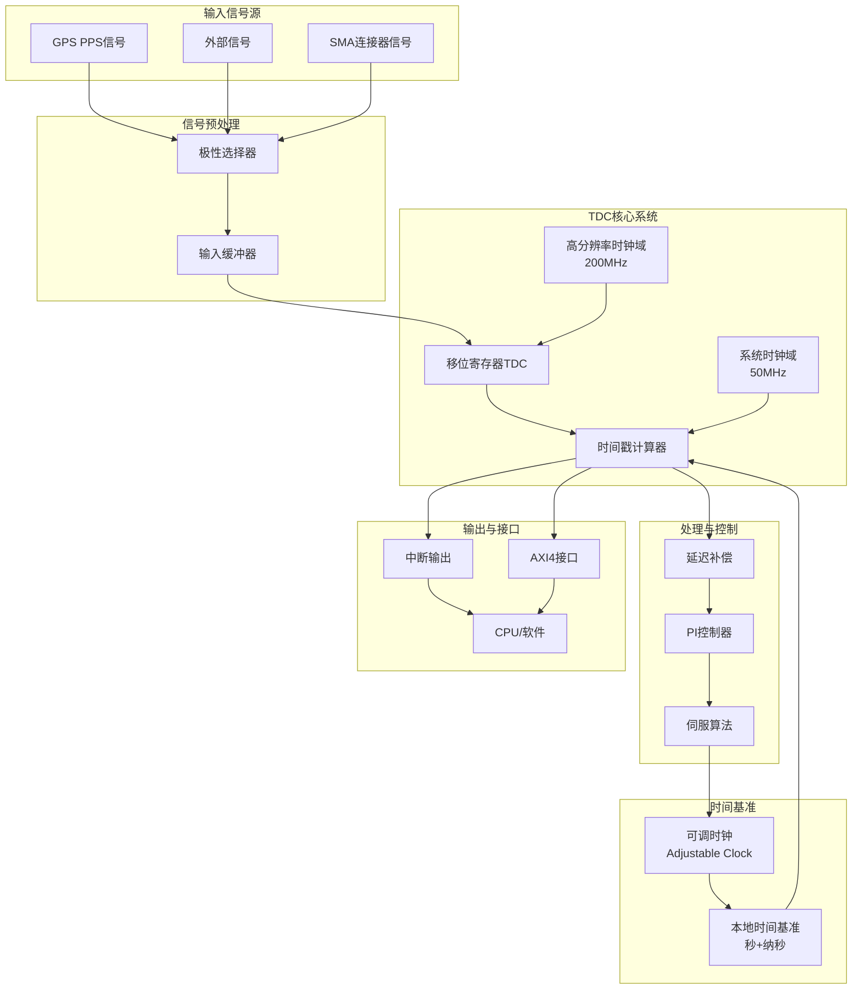
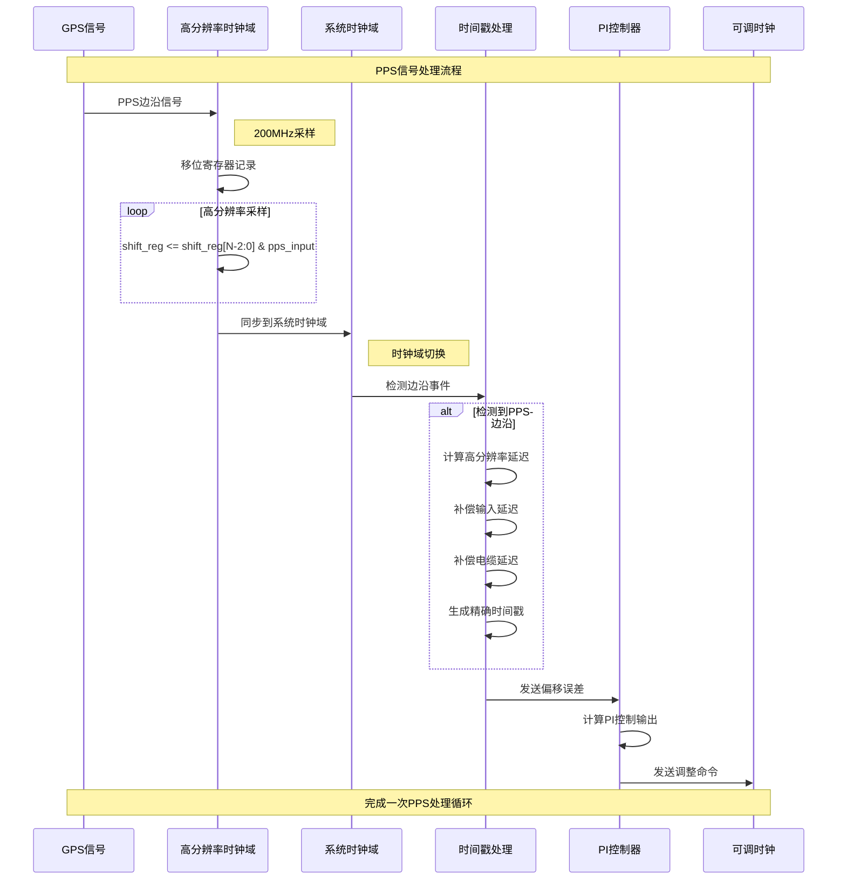
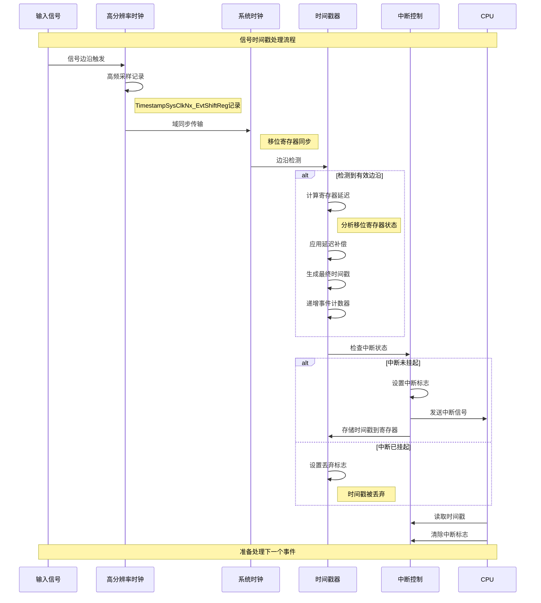
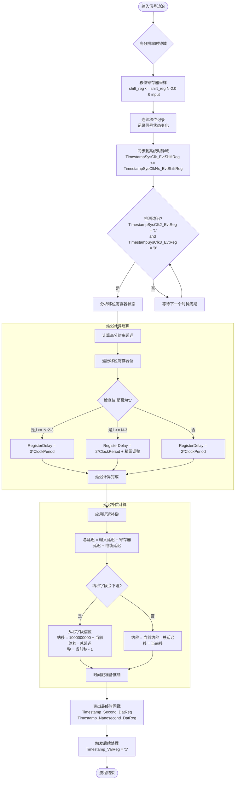
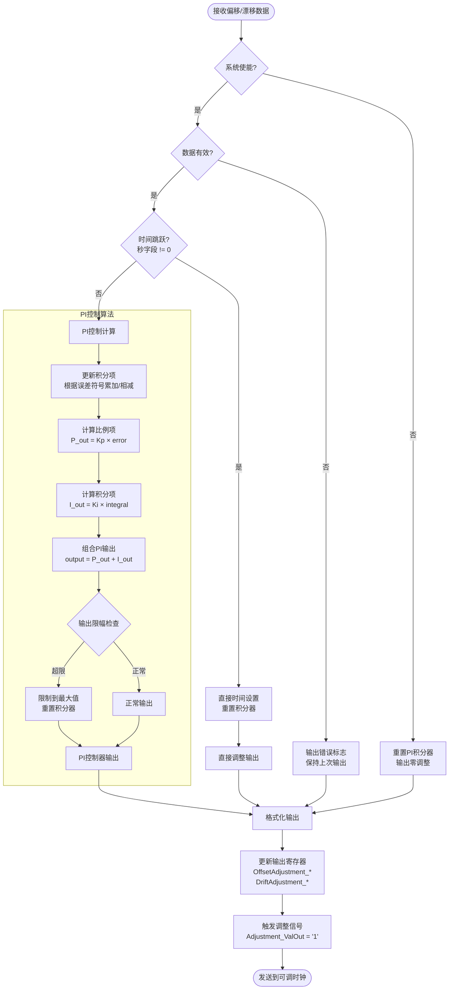
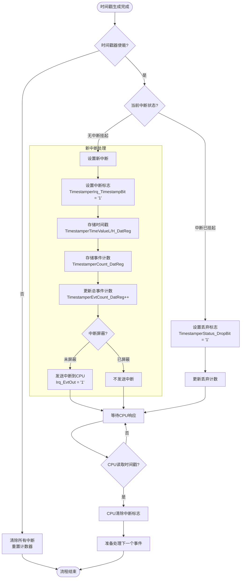
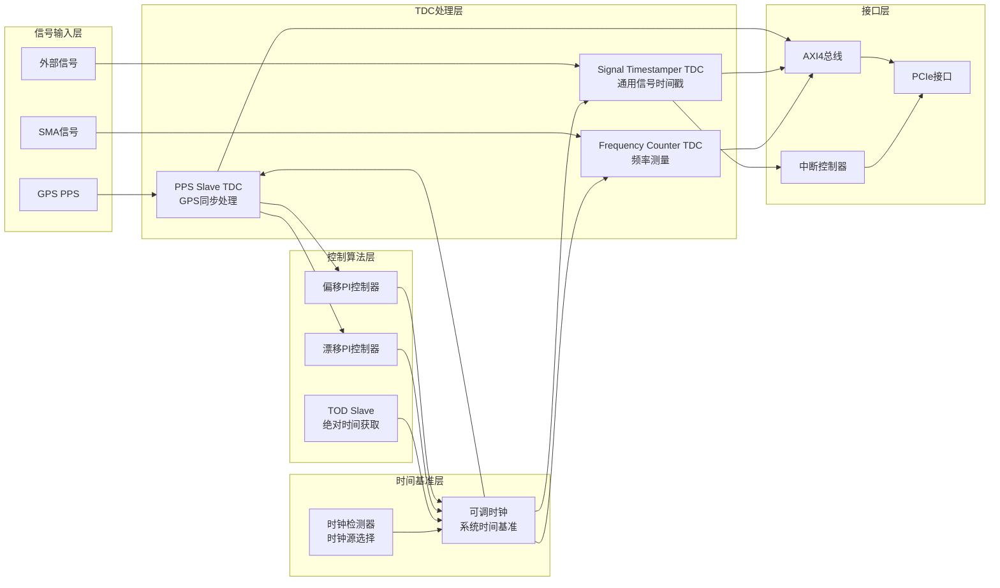
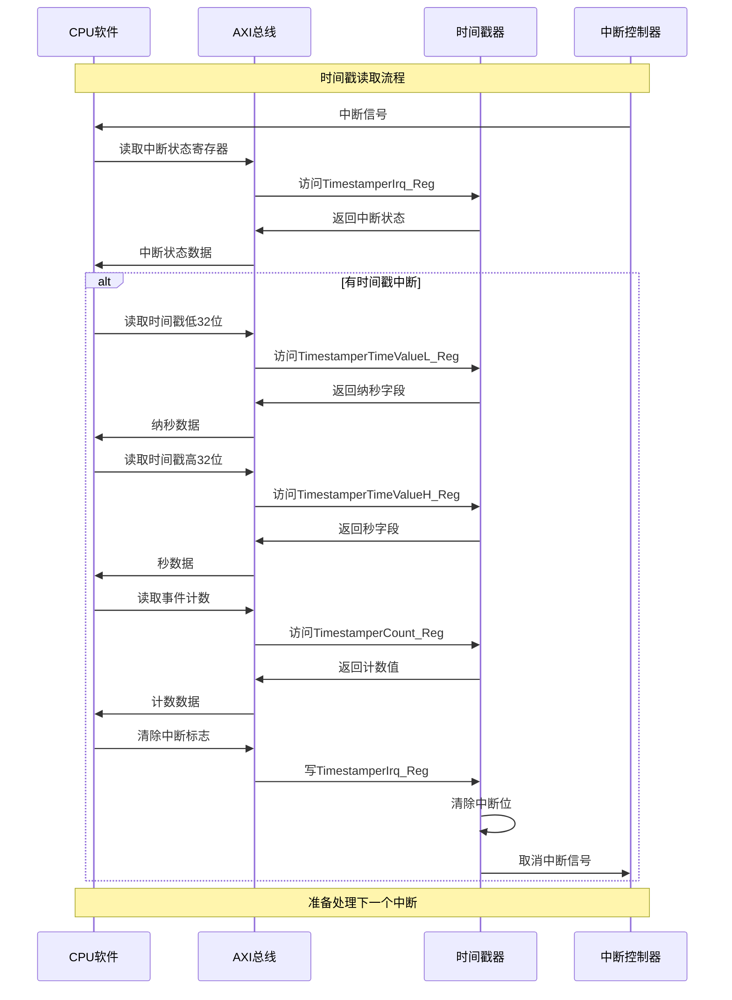
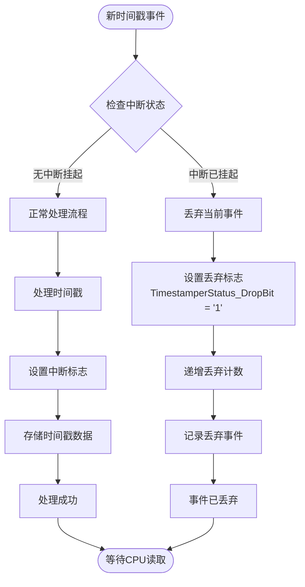

# 时钟定时卡TDC系统工作流程图

## 概述

本文档通过详细的Markdown流程图，展示时钟定时卡中TDC（Time-to-Digital Converter）系统的完整工作流程，包括信号触发、时间戳采集、处理和输出的全过程。

## 系统架构流程图



## 详细工作流程

### 1. PPS Slave TDC工作流程



### 2. 信号时间戳器TDC工作流程



### 3. 高分辨率时间戳生成详细流程



### 4. PI控制器处理流程



### 5. 中断处理流程



### 6. 系统级TDC集成流程



## 关键时序参数

### 时间精度参数

| 参数 | 数值 | 说明 |
|------|------|------|
| 系统时钟频率 | 50MHz | 基准时钟频率 |
| 高分辨率时钟频率 | 200MHz | TDC采样频率 |
| 时间戳分辨率 | 5ns | 理论最高精度 |
| 寄存器延迟 | 2-3个时钟周期 | 时钟域切换延迟 |
| 输入延迟 | 可配置 | 缓冲器延迟补偿 |
| 电缆延迟 | 可配置 | 传输延迟补偿 |

### 处理延迟分析

```
总处理延迟 = 高分辨率采样延迟 + 域同步延迟 + 计算延迟 + 输出延迟

其中:
- 高分辨率采样延迟: 0-5ns (取决于信号到达时间)
- 域同步延迟: 20ns (1个系统时钟周期)
- 计算延迟: 40-60ns (2-3个系统时钟周期)
- 输出延迟: 20ns (1个系统时钟周期)

总延迟范围: 80-105ns
```

## 软件接口流程

### CPU读取时间戳流程



## 故障处理流程

### 时间戳丢弃处理



## 总结

时钟定时卡的TDC系统通过以下关键技术实现高精度时间测量：

1. **双时钟域设计**: 高分辨率时钟域(200MHz)进行精确采样，系统时钟域(50MHz)进行处理
2. **移位寄存器TDC**: 利用移位寄存器记录信号状态变化，实现亚纳秒级精度
3. **多级延迟补偿**: 补偿寄存器延迟、输入延迟、电缆延迟等系统性误差
4. **PI控制反馈**: 通过PI控制器实现闭环时间同步
5. **中断驱动处理**: 高效的中断机制确保实时响应
6. **软硬件协同**: AXI接口提供灵活的软件控制和监控能力

整个系统从信号输入到最终输出，实现了完整的TDC功能，为高精度时间同步提供了可靠的硬件基础。
